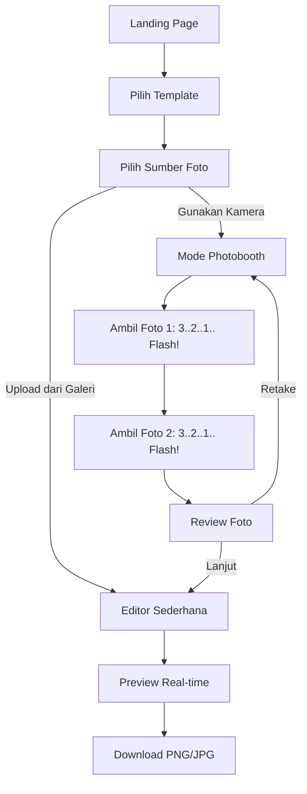

# Application Flow

## Detailed Steps

1. **Pilih Template:** User melihat daftar template beserta detail jumlah slot foto.
2. **Pilih Sumber Foto:**
   - **Upload:** User memilih file dari device.
   - **Kamera:** Meminta izin akses kamera via WebRTC.
3. **Mode Photobooth (Kamera):**
   - Pengalaman layaknya photobooth asli.
   - Timer otomatis (3s) untuk setiap frame.
   - Animasi flash dan suara shutter untuk setiap pengambilan.
4. **Custom Waifu Upload & AI Background Removal (Standalone Backend)**
- Pengguna dapat mengklik tombol "Unggah Foto ke AI" di halaman Editor.
- Frontend mengirim foto melalui request POST `FormData` ke API eksternal `backend` (misal: `http://localhost:4000/api/remove-bg`).
- Server `backend` menggunakan model ML *transformers.js* (`briaai/RMBG-1.4`) dan `sharp` untuk menghapus *background* tanpa membebani HP/PC pengguna.
- Server mengembalikan gambar PNG transparan.
- Frontend merender gambar tersebut sebagai stiker (Tipe: `image`) di kanvas. Stiker ini bisa diputar, diperbesar, dan digeser.
5. **Review Foto:**
   - User melihat hasil jepretan.
   - Tersedia opsi untuk mengulang satu foto tertentu atau semuanya.
6. **Editor:**
   - User dapat melakukan drag (geser), zoom, rotate, dan flip untuk masing-masing foto agar pas dengan slot template.
7. **Preview:**
   - Hasil akhir ditampilkan dengan frame/overlay template secara real-time.
8. **Download:**
   - Render ulang canvas dengan resolusi penuh (300 DPI).
   - Unduh ke perangkat pengguna.
